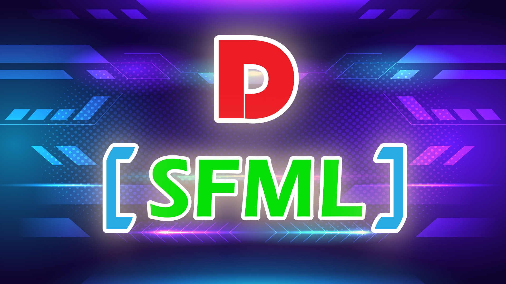

# D/SFML project template

This is a project template for D and SFML multimedia library with DUB. It does static linking with libraries. 

Check out the [`dub.json`](dub.json) for configuration example.



### Required toolchain
* [D](https://dlang.org/download) compiler
* [DUB](https://dub.pm/) package manager

### Dependencies
D uses the [bindbc-sfml](https://github.com/BindBC/bindbc-sfml) packages. It is handled by DUB automatically. Please, ensure you have `SFML` library installed on your system. 

#### Linux
```
sudo apt install libsfml-dev libcsfml-dev
```

#### MacOS
```
brew install sfml csfml
```

### Windows
1. Download [CSFML](https://www.sfml-dev.org/download/csfml/) library for Windows. 
2. Copy all `lib/mvsc/*.lib` files to your working directory along side `source` and `dub.json`
3. Copy all `bin/*.dll` binaries to your executable folder. In this case it is `bin` along side `source` and `dub.json`

### Modify your config file
```
// dub.json
"dependencies": {
   "bindbc-sfml": "~>1.0.2"
},
"versions": [
   "BindSFML_Static", "SFML_Audio", "SFML_Graphics", "SFML_Network", "SFML_System", "SFML_Window"
],
"libs": [
   "csfml-audio", "csfml-graphics", "csfml-network", "csfml-system", "csfml-window"
]
```
```
// dub.sdl
dependency "bindbc-sfml" version="~>1.0.2"
versions "BindSFML_Static" "SFML_Audio" "SFML_Graphics" "SFML_Network" "SFML_System" "SFML_Window"
libs "csfml-audio" "csfml-graphics" "csfml-network" "csfml-system" "csfml-window"
```

### Compiling and running
```
dub --build=release
```
`--build=release` is optional. Simply `dub` will compile and run the project automatically.

### LICENSE
All code is licensed under BSL software license.

